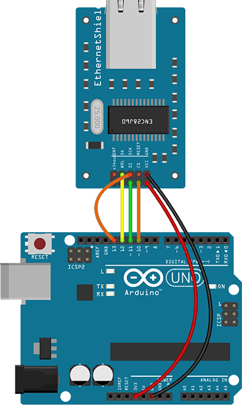
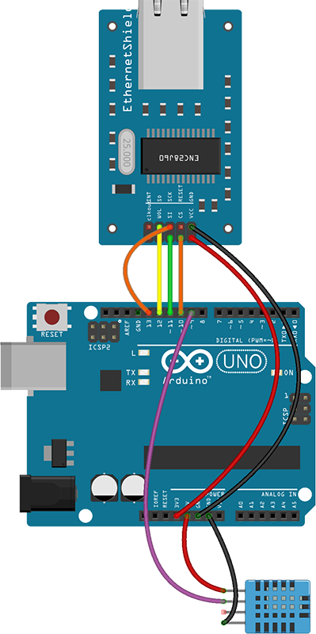

# Arduino-Ethernet-Sensor

## Arduino Weather Station

**First, lets create the Database in the Local Web Server**

**Database Name is: sensor**

**Table Name is: mydata**

**The structure of mydata Table in the Database is as Follows:**

| # | Name    | Type          | Extra        |
|---|---------|---------------|--------------|
|1  |id       |int(11)        |AUTO_INCREMENT|
|2  |time     |timestamp      |              |
|3  |hum      |varchar(10)    |              |
|4  |temp     |varchar(10)    |              |

**The Ethernet module used is ENC28J60**

*The  ENC28J60  is  a  stand-alone  Ethernet  controller
with  an  industry  standard  Serial  Peripheral  Interface
(SPI).  It  is  designed  to  serve  as  an  Ethernet  network
interface for any controller equipped with SPI.*

**Connect ENC28J60 to an Arduino Uno Board**

[Wiring Designed Using Fritzing Software: http://fritzing.org/home/](http://fritzing.org/home/)

**Connect the DHT11 Sensor to an Arduino Uno Board**

[Wiring Designed Using Fritzing Software: http://fritzing.org/home/](http://fritzing.org/home/)

**Libraries :**

*The Library for the Ethernet Module is :*

*UIPEthernet Library :* [UIPEthernet](https://github.com/ntruchsess/arduino_uip/)

*The Library for the DHT11 sensor is :*

*DHT Library :* [Adafruit DHT Humidity & Temperature Unified Sensor Library](https://github.com/adafruit/DHT-sensor-library)
