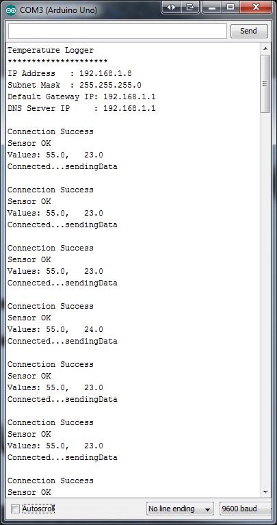
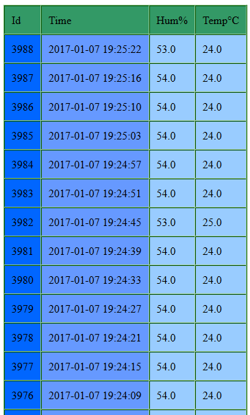

# Arduino-Ethernet-Sensor

## Arduino Weather Station

**First, lets create the Database in the Local Web Server**

**Database Name is: sensor**

**Table Name is: mydata**

**The structure of mydata Table in the Database is as Follows:**

| # | Name    | Type          | Extra        |
|---|---------|---------------|--------------|
|1  |id       |int(11)        |AUTO_INCREMENT|
|2  |time     |timestamp      |              |
|3  |hum      |varchar(10)    |              |
|4  |temp     |varchar(10)    |              |

*The AUTO_INCREMENT keyword is used to perform an auto-increment feature. The starting value for AUTO_INCREMENT is 1, and it will increment by 1 for each new record.*

*hum Stands for Humidity and temp Stands for Temperature.*

*Type timestamp is used to keep track of when data is added to the Database.*

**The Ethernet module used is ENC28J60**

*The  ENC28J60  is  a  stand-alone  Ethernet  controller
with  an  industry  standard  Serial  Peripheral  Interface
(SPI).  It  is  designed  to  serve  as  an  Ethernet  network
interface for any controller equipped with SPI.*

**Connect ENC28J60 to an Arduino Uno Board**

*Below we can see the wiring between an Arduino Uno R3 and the Ethernet module ENC28J60.*

*ETHERNET WIRING :
Arduino Uno pins: 10 = CS, 11 = MOSI, 12 = MISO, 13 = SCK*

[Wiring Designed Using Fritzing Software: http://fritzing.org/home/](http://fritzing.org/home/)

**DHT11 is a digital Humidity-Temperature Sensor**

*DHT11 uses a capacitive humidity sensor and a thermistor to measure the surrounding air, and spits out a digital signal on the data pin*

**Connect the DHT11 Sensor to an Arduino Uno Board**

*Complete Wiring. Arduino Uno R3 & Ethernet Module ENC28J60 & DHT11 Sensor.*

[Wiring Designed Using Fritzing Software: http://fritzing.org/home/](http://fritzing.org/home/)

**Libraries :**

*The Library for the Ethernet Module is :*

*UIPEthernet Library :* [Arduino Ethernet library for ENC28J60 shields and breakout boards](https://github.com/ntruchsess/arduino_uip/)

*The Library for the DHT11 sensor is :*

*DHT Library :* [Adafruit DHT Humidity & Temperature Unified Sensor Library](https://github.com/adafruit/DHT-sensor-library)

**Arduino Uno Serial Monitor :**

*Debug mode is On. We can see all the Serial.print() Messages*

*At first, we get all the information about the Network, such as the client's IP Address, the Subnet Mask IP of the Network, the Default Gateway IP address and the DNS Server IP. Then, we get some extra information about the Status of the Ethernet Module and the Status of the Sensor. We get a "Connection Success" for the Ethernet Module and a "Sensor OK" for the DHT11. So everything is working as expected. Finally, the values humidity and temperature are printed and sent to the Local Server.*

**Arduino HTML Data Table :**

*In the table bellow we see the data sent to our database. More specifically, there is a DHT11 humidity-temperature Sensor connected to our Arduino and periodically via a network connection using the Ethernet Module ENC28J60 these data are recorded in a database. All the recordings are shown in detail in the list bellow.*

